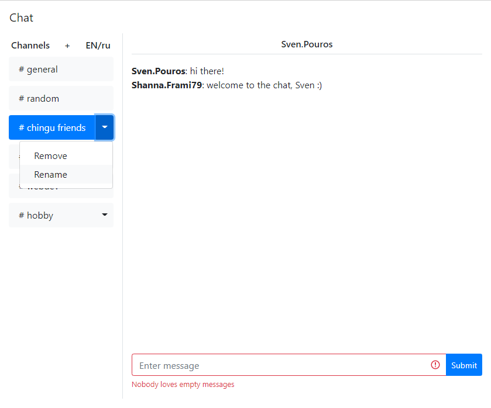

# Chat (Slack)

## Overview

This is a simple Slack-like chat application.

#### DEMO - https://chat-slack-chessiah.herokuapp.com

[](https://github.com/alekseyvlivanov/chat-slack/actions)
[](https://codeclimate.com/github/alekseyvlivanov/chat-slack/maintainability)

<div align="center">

</div>

## Features

- local preinstalled [Fastify](https://github.com/fastify/fastify) server
- frontend uses REST/websockets to send/get data to/from backend
- generates fake username for new session and stores it in cookie
- add, rename and remove channels
- real-time chat for every channel
- form validation
- internationalization (EN/RU)
- using [Makefile](https://makefile.site) for better command management
- [Rollbar](https://docs.rollbar.com/docs/browser-js) is used for error monitoring

## Dependencies

- React plus hooks bootstrapped with CRA
- [Redux Toolkit](https://redux-toolkit.js.org) for efficient Redux development
- [axios](https://github.com/axios/axios) for AJAX
- styling with [React Bootstrap](https://react-bootstrap.github.io)
- interface localization with [react-i18next](https://react.i18next.com/)
- [faker.js](https://github.com/marak/Faker.js/) to generate realistic fake username
- [JavaScript Cookie](https://github.com/js-cookie/js-cookie) to store username
- [Formik](https://github.com/formium/formik) to build forms
- validating form data with [Yup](https://github.com/jquense/yup)
- [Socket.IO](https://socket.io) on client and server for real-time communication

## Install

```
$ git clone ...
$ cd chat-slack
$ make  install
```

then install [Heroku CLI](https://devcenter.heroku.com/articles/heroku-cli).

## Usage

```
$ make start
```

and open http://localhost:5000 in your browser, or

```
$ make deploy
```

and open your Heroku application.
